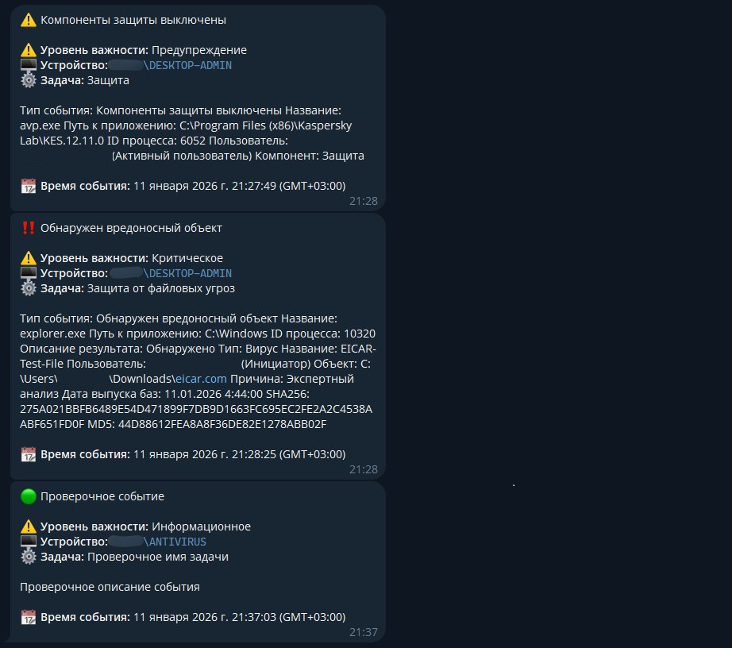
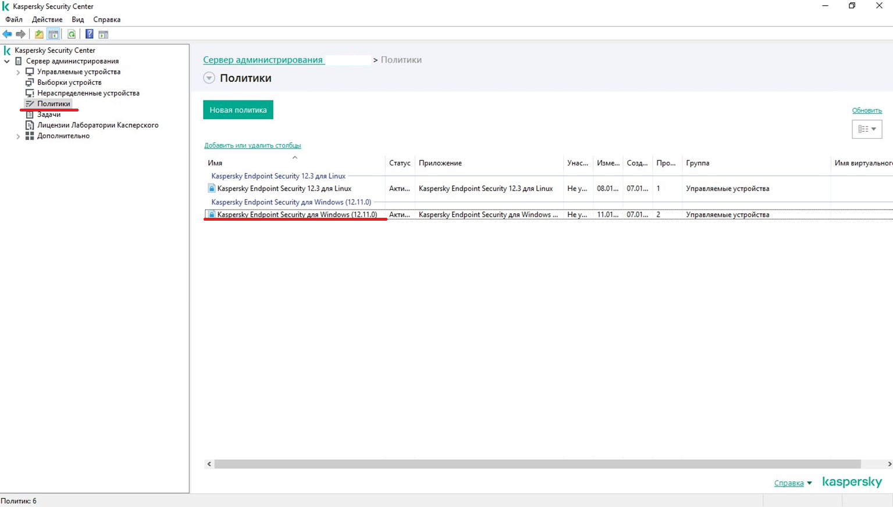
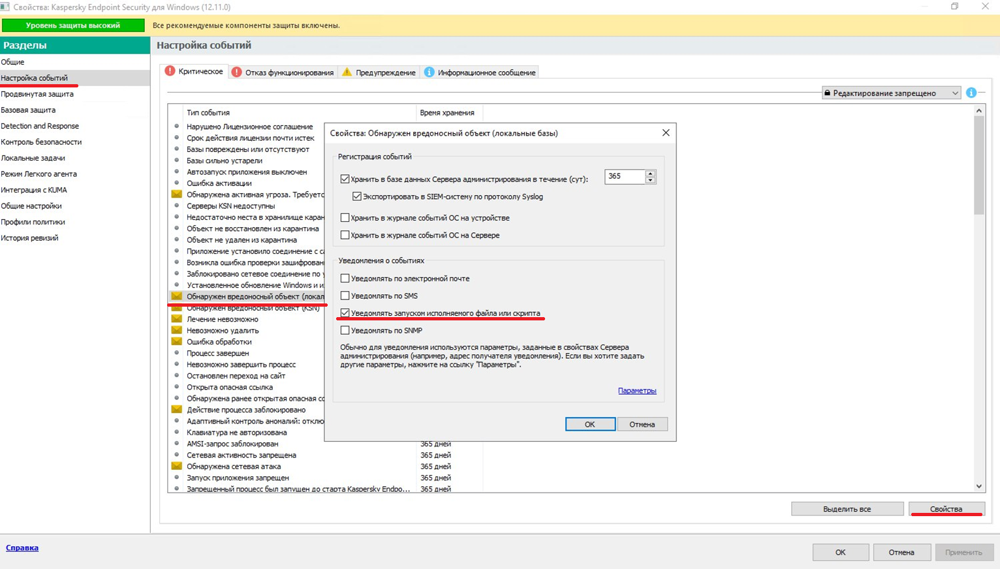

# Оповещения Kaspersky Security Center в Telegram

Kaspersky Security Center имеет функцию [уведомление о событиях с помощью исполняемого файла](https://support.kaspersky.com/ksc/14/ru-RU/84509.htm). В данном репозитории опубликован скрипт для реализации данных оповещений в Telegram, а так же инструкция по настройке.



## Конфигурация скрипта
`config.json` - конфигурационный файл скрипта. 

> [!NOTE]
> Обязательно заполните значения `chat_id` и `bot_token` - без этого уведомления работать не будут! 

```json
{
  "telegram": {
    "chat_id": "",
    "bot_token": ""
  },
  "skip_ssl": true,
  "hide_ip": true,
  "hide_app_info": true
}
```
* `chat_id` - string* - идентификатор пользователя telegram которому будут приходить уведомления. (Узнать его можно в: [@MyTidBot](https://t.me/MyTidBot)).
* `bot_token` - string* - токен бота telegram.
* `skip_ssl` - bool - отключает проверку ssl сертификата целевого домена `https://api.telegram.org` (Установите в значение в true если тестовое уведомление не отправляется. Это может происходить если на сервере установлен KES, он по умолчанию подписывает все домены собственным сертификатом что мешает работе скрипта.)
* `hide_ip` - bool - скрывает из уведомления информацию о ip адресе хоста.
* `hide_app_info` - bool - скрывает бесполезную информацию о названии и версии приложения Kaspersky.

## Инструкция по использованию

1. [Скачайте файлы](https://github.com/HardManDev/ksc-telegram-alert/releases/download/1.0.0/ksc-telegram-alert.tar) проекта и поместите их в удобную вам директорию на сервере Kaspersky Security Center например: `D:\KSC Telegram Alert`. Выполните пункт: [Конфигурация скрипта](#конфигурация-скрипта)
2. Откройте консоль администрирования KSC (десктопную версию MMC) и подключитесь к серверу администрирования.
3. Кликните ПКМ по пункту "Сервер администрирования <ИМЯ_МАШИНЫ>".
4. Откройте окно "Свойства".
5. Перейдите к разделу "Уведомление".
6. Перейдите на вкладку "Исполняемый файл для запуска".
7. Нажмите "Обзор" и выберете файл `alert.bat` из директории проекта.
8. Нажмите кнопку "Отправить тестовое сообщение" и при успешном получении можете применять настройки

## Конфигурация KSC
По умолчанию вы не будите получать события. Для того что бы начать их получать, вам необходимо задать параметр **"Уведомлять запуском исполняемого файла или скрипта"** в настройках политики клиентского приложения и (или) в конфигурации сервера администрирования для событий сервера. 



